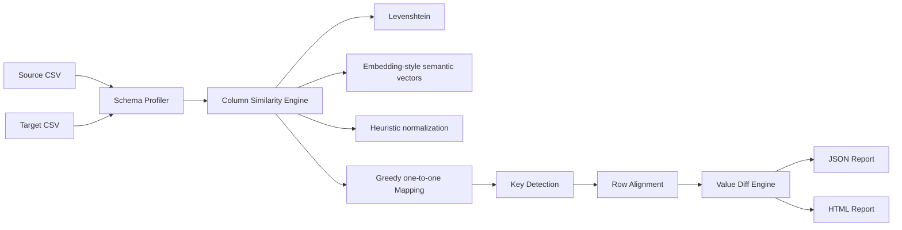

# Architecture

## Implemented module: Module 2 — Intelligent CSV Comparison Tool

## Why this design

The comparison is split into explainable stages so an interviewer can inspect each decision. Column mapping does not rely on one black-box score. It combines:

- Levenshtein similarity for spelling and naming drift.
- Local embedding-style semantic vectors for synonym and concept overlap.
- Heuristic normalization for abbreviations, camelCase, snake_case, and common data-engineering naming patterns.

The report exposes the score breakdown instead of hiding it. Low-confidence mappings are flagged for human review.

## Production extensions

For larger files, the in-memory pandas comparator should be replaced by a streaming or distributed backend such as DuckDB, Polars, Spark, or Dataflow. The public interface can stay the same because comparison stages are already separated.

For stronger semantic mapping, replace the deterministic local embedding implementation with OpenAI embeddings, Cohere embeddings, or a local sentence-transformers model. The code currently avoids network dependency so the demo is reliable in interview environments.

## Modules not fully implemented

The take-home asks for a platform with four modules but only describes Module 2 in detail. The repository prioritizes depth over breadth for Module 2. Additional modules would follow the same structure:

1. `src/<module>` for implementation.
2. `prompts/<module>_vN.md` for versioned prompts.
3. `tests/test_<module>.py` for runnable tests.
4. `docs/<module>_design.md` for tradeoffs and architecture.
