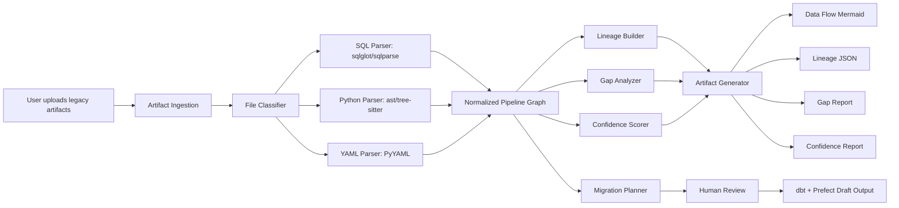
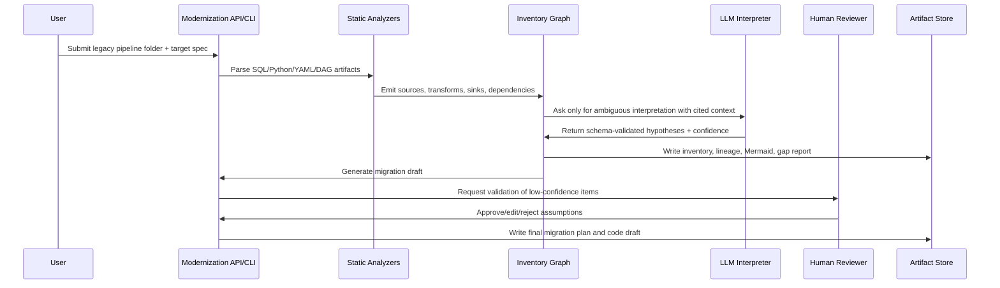

# Architecture Design — Module 4 Legacy Data Pipeline Modernization

## Goal

Analyze a legacy data pipeline, produce documentation artifacts, and draft a migration plan to a modern target state such as **Airflow + raw SQL → dbt + Prefect on Snowflake**.

## Component architecture

## Tools and framework evaluation

### LLM orchestration

| Candidate | Fit | Tradeoff |
|---|---|---|
| LangChain | Good for chains, tool calling, structured output, prompt templates | Can become complex if overused |
| LlamaIndex | Strong for document ingestion and retrieval over large code/doc corpora | Less necessary for simple deterministic parsing |
| AutoGen | Strong for multi-agent collaboration and review loops | More moving parts for take-home demo |

**Chosen approach:** a lightweight prompt-runner abstraction for the POC. In production, use LangChain or LlamaIndex only around ambiguous interpretation and migration planning, not for deterministic parsing.

### Code parsing

| Candidate | Use | Why |
|---|---|---|
| `ast` | Python ETL and DAG parsing | Native, reliable, easy to test |
| `sqlglot` | SQL parsing and lineage hints | Dialect-aware, better than regex |
| `sqlparse` | SQL formatting/token fallback | Useful but less semantic |
| `tree-sitter` | Multi-language parsing | Strong production option for Scala/Java/Shell legacy code |

**Chosen approach:** `ast`, `sqlglot`, `PyYAML`, with regex fallbacks where a file cannot be fully parsed.

### Lineage

| Candidate | Fit | Tradeoff |
|---|---|---|
| OpenLineage | Standard event model for runtime lineage | Needs instrumentation/runtime events |
| Marquez | Lineage metadata backend | More infrastructure than needed for POC |
| NetworkX/custom graph | Simple static dependency graph | Needs future mapping to lineage standards |

**Chosen approach:** custom typed graph in the POC. Production should export to OpenLineage/Marquez after validation.

### Graph rendering

| Candidate | Fit |
|---|---|
| Mermaid | Best for GitHub documentation and take-home review |
| Graphviz | Better for large static graphs |
| D3.js | Best for interactive web UI |

**Chosen approach:** Mermaid for immediate reviewability.

### Vector store

| Candidate | Fit | Tradeoff |
|---|---|---|
| Chroma | Local POC retrieval | Easy setup |
| pgvector | Production-friendly if Postgres exists | Operationally simple |
| Weaviate | Scalable semantic retrieval | More infrastructure |

**Recommended production use:** index parsed chunks, code comments, README files, previous migration decisions, and human review notes. Retrieval should feed only relevant context into LLM prompts.

### Pipeline runtime target

| Candidate | Fit |
|---|---|
| Airflow | Mature scheduling; common legacy source |
| Prefect | Good Python-native orchestration and local/dev ergonomics |
| Dagster | Strong software-defined assets and lineage |
| dbt | Best place for SQL transformations, tests, docs, and lineage |

**Chosen target:** dbt for transformations plus Prefect for orchestration.

## End-to-end process flow

## LLM engineering strategy

- Static parser output is the source of truth.
- LLM prompts are stored in `prompts/` and versioned.
- LLM output must be JSON schema validated before merging into inventory.
- Every LLM inference must cite file path and line span.
- Context window is managed by retrieval: include parsed graph, relevant code snippets, and prior human decisions only.
- Ambiguous claims are stored as hypotheses, not facts.

## Confidence scoring strategy

Each node and edge receives a score from 0.0 to 1.0:

| Evidence | Example | Score impact |
|---|---|---|
| Explicit | `INSERT INTO mart.orders SELECT ... FROM raw.orders` | High |
| Parsed semantic | SQL AST says `raw.orders` feeds `mart.orders` | High |
| Config declared | YAML declares source/sink | Medium-high |
| Naming inferred | `load_customers.py` likely loads customer data | Medium-low |
| LLM-only | No deterministic evidence | Low unless validated |

Penalties are applied for wildcard selects, dynamic SQL, unresolved imports, missing configs, missing owners, and schedule ambiguity.

## Human-in-the-loop

Human review is mandatory for:

1. Low-confidence lineage edges below 0.70
2. Dynamic SQL or runtime-generated table names
3. Business-critical transformations
4. Deleting dead code
5. Migrated code before deployment
6. Schedule/SLA/ownership changes

The human reviewer can approve, reject, or edit each assumption. Their decisions should be persisted and used as high-confidence context for future runs.

## Known limitations

- Static analysis cannot fully resolve runtime behavior.
- Column-level lineage can be incomplete for UDFs, macros, stored procedures, dynamic SQL, and external APIs.
- Data volumes require runtime metadata; this POC only reads explicit hints.
- Generated migration code must be treated as a draft until reviewed and tested.
